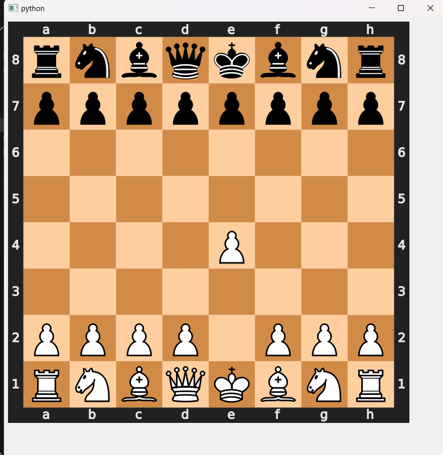

**PHASE-1**

here in this file am going to document each and every step that i did to code the chess bot that will probably play like me when i finish this process.

So first in this folder there are a lot of xlsx folder these were actually csv files that i downloaded from opentree.com
open tree is a website that is used to download the data of a player's chess games from "chess.com" in pgn format
i used a pgn data converted inorder to convert the pgn data in excel format
i used PGN2DATA module to make this happen

[this is kinda like my personal way of noting down the things so it will help me to look back and not get too confused on how i did the following process]

So the next was to make another excel file that contained only the data that is needed for training my bot, hence i tried to automate it by some programs but it wasnt much of a help so i created an excel file on my own and copied the data from my main file to this subsidary file, this file had an index, move no , and also the move of each player and a probability rating that looks after the same move from the overall data thus giving me an estimated value on how much am i relying on the same move this is a very crucial information as am going to perform a somewhat similar kind of supervised learning that will train itself on repetitive data idk as am in the first phase this is my overall idea , and to be noted this idea is not mine and am referring to a youtube video inorder to get a hang of it, there arent much resources for training a chess engine to play like a specific player

these are the excel formulas that i used in the "clean_moves.xlsx" file

for move1 : =IF(C2="ballloverpgo", D2, "")
for move2 : =IF(C2<>"ballloverpgo", D2, "")
for probability : =COUNTIF(D:D,D2)/COUNTA(D:D)

**PHASE-2**

Now i have created a file named chess_bot.py
this file for now that is when am writing this( or typing) creates a GUI i.e., graphical user interface of a chess board
i had to set up the chess board using chess(a python module) and pyqt5 (used to build guis)
now that i have a bunch of resources like the chess svg from chess.svg and pyqt5( gui build) the board geometry and other parameters where set
and the instance was called displaying a chess board which is a static svg it can neither be moved nor interacted with the only way to use it is to give it commands through the terminal and if we play with for long time without clearing the repetitive windows produces .., it will result in a casual withdrawal of pc from its workflow a.k.a crashing the pc
but anyways it is morethan enough to train a ai chess engine i would just give a window.close() function after each iteration to make sure the window doesnot repeat itself or gets stacked

when i push the move it works which is a good thing

after a long struggle of trying to read documents and other related articles on how to contruct this bot i landed on a github page which exactly gives me the thing that i want to do

What i did was actually its a pretty interesting mechanism and happy and sad that the chess bot performs worse but actually happy that it plays like me, anyways what it does is that

i have created a seperate xlsx file which is ends with the name V2 it consist of some values such as move move_number player response ect and most importantly FEN

FEN is the governing factor of the working of this program
FEN is a string notation that gives the current state of the chess board and this data is very much crucial because....
WE ARE GOING TO TRAIN THE MACHINE LEARNING MODEL WITH THE HELP OF THIS
WE TAKE THE CURRENT STATE OF THE BOARD AND AS A RESULT (THAT IS Y_TRAIN) WE GIVE IT THE RESPONSE

but for this we have to convert it to a list of numbers because come on dude random forest isnt able to process any strings so what we are going to do is convert the fen to some kind of numeric values that is done by providing a dictionary.. then after the fen is converted to an array it is exposed to onehot encoder this is to make sure that all the values come under the same bracket mostly (-3 to +3) now that we have converted the FEN into a matrix of numbers we can use randomforestclassifier in it.

now as u can see the machine learning model (using random forest classifier) learns the pattern that is if the state of the board is like this the player(me) is going to perform this action and this is based on the probability i.e., the times i have used this move in my actual games
so this kind of mimics my style of playing even though its kinda dumb.

Now that we have tackled the problem of training our model what we now actually have to do is tackle another problem (classic prgramming experience)

the another problem is making sure the model is trained only to the legal moves which is not really that big of a problems because we can create a boolean condition using if that is if (the move to be trained) is not in the list of legal moves (chess.board.legal_moves()) then its excluded ,
what a simple solution right

now that we have created a bot that plays like us in a similar way we have to make sure that it isnt exactly that dumb, so what we have to do is now we have to make a chess engine monitor the whole gameplay so that it could evaluate and replace essential blunders that might be caused due to the training that we have done.

for this we are going to use stockfish and we are going to feed it each and every move and it will evaluate and print the result and if anything goes wrong there is a fat chance (9/10) that the move will be replaced by stockfish

As you can see maybe this is for me i underestimated the FEN value so much but at last it was the one that made it happen.
